# 🏦 Online Bankacılık Sistemi - Parion

Modern ve güvenli bir online bankacılık uygulaması. Spring Boot kullanılarak geliştirilmiş, kullanıcı dostu arayüzü ile finansal işlemlerinizi kolayca gerçekleştirebilirsiniz.

## ✨ Özellikler

- 🔐 Güvenli kullanıcı kimlik doğrulama ve yetkilendirme
- 📧 E-posta doğrulama sistemi ile güvenli kayıt
- 💳 Hesap yönetimi ve bakiye takibi
- 💸 Para transferi işlemleri
- 📊 Döviz kurları ve altın fiyatları takibi
- 📝 İşlem geçmişi görüntüleme
- 📄 PDF formatında hesap hareketi raporu
- 📧 Otomatik e-posta ile hesap özeti gönderimi
- 👥 Kayıtlı alıcılar yönetimi
- 💰 Para yatırma ve çekme işlemleri
- 📨 E-posta bildirimleri

## 🛠️ Teknolojiler

### Backend

- Java 17
- Spring Boot 3.x
- Spring Security
- Spring Data JPA
- Maven

### Frontend

- Thymeleaf
- Tailwind CSS
- JavaScript/jQuery
- Bootstrap 5

### Veritabanı

- MySQL 8.0

### API ve Dokümantasyon

- REST API
- Postman Collections

### Entegrasyon ve Servisler

- JavaMail API (E-posta servisi)
- iText PDF (PDF oluşturma)
- Exchange Rate API (Döviz kurları)
- Gold Price API (Altın fiyatları)

### Güvenlik

- BCrypt (Şifreleme)
- JWT (Token bazlı kimlik doğrulama)
- Spring Security
- CSRF Koruması

## 📋 Gereksinimler

- JDK 17 veya üzeri
- Maven 3.6.x veya üzeri
- MySQL 8.0 veya üzeri

## 🚀 Kurulum

1. Projeyi klonlayın:

```bash
git clone https://github.com/selcukatasoglu/digital-banking-system.git
```

2. MySQL veritabanını oluşturun:

```sql
CREATE DATABASE project_name;
```

3. `application.properties` dosyasını düzenleyin:

```properties
spring.datasource.url=jdbc:mysql://localhost:3306/digital-banking-system
spring.datasource.username=YOUR_USERNAME
spring.datasource.password=YOUR_PASSWORD
```

4. Projeyi derleyin:

```bash
mvn clean install
```

5. Uygulamayı çalıştırın:

```bash
mvn spring-boot:run
```

6. Aç:

```
http://localhost:8080

```

## 📱 Ekran Görüntüleri

### Giriş (Login) Sayfası

| Light                                                                | Dark                                                               |
| -------------------------------------------------------------------- | ------------------------------------------------------------------ |
| 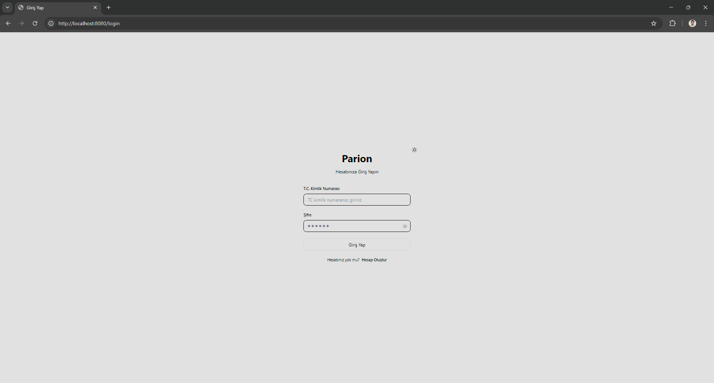 | 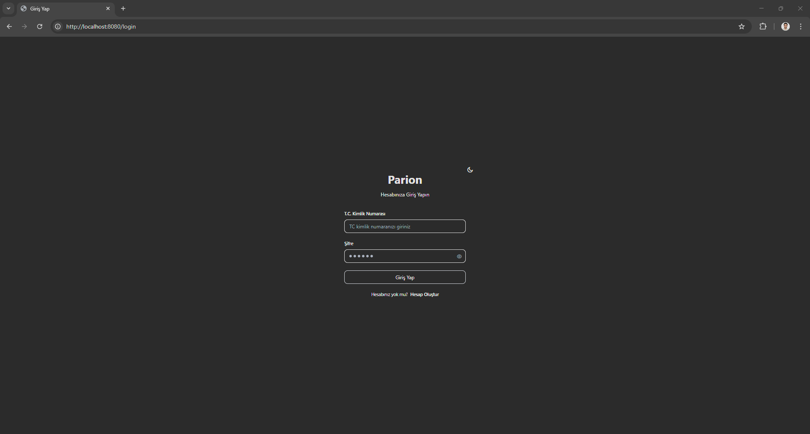 |

### Kayıt Ol (Register) Sayfası

| Light                                                                      | Dark                                                                     |
| -------------------------------------------------------------------------- | ------------------------------------------------------------------------ |
| 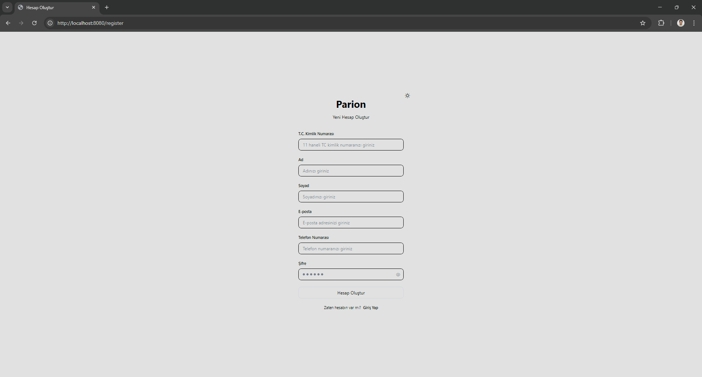 | 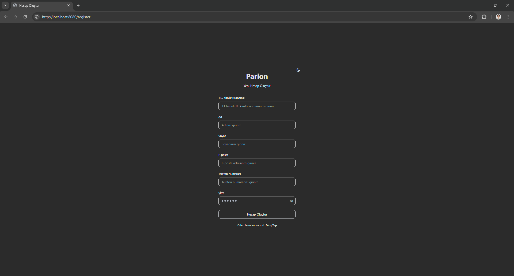 |

### Dashboard

| Light                                                                        | Dark                                                                       |
| ---------------------------------------------------------------------------- | -------------------------------------------------------------------------- |
| 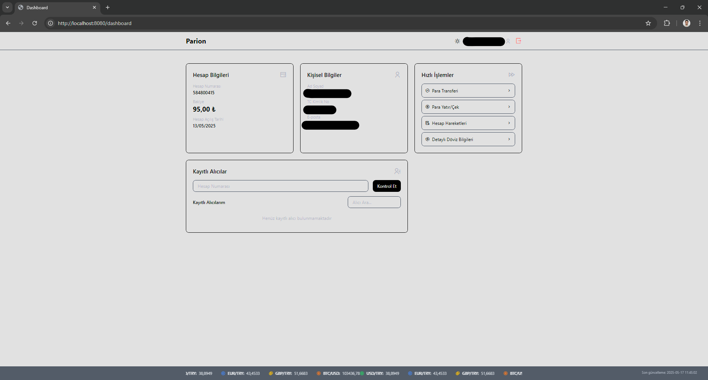 | 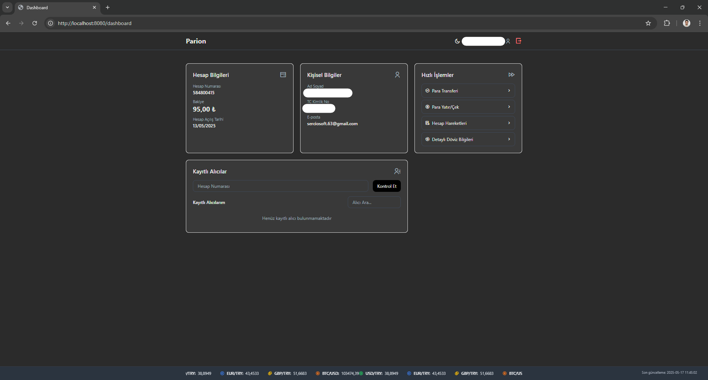 |

### Para Yatırma / Çekme (Deposit / Withdrawal)

| Light                                                                                         | Dark                                                                                        |
| --------------------------------------------------------------------------------------------- | ------------------------------------------------------------------------------------------- |
| 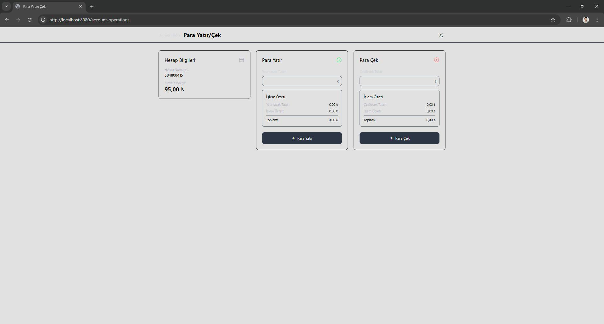 | 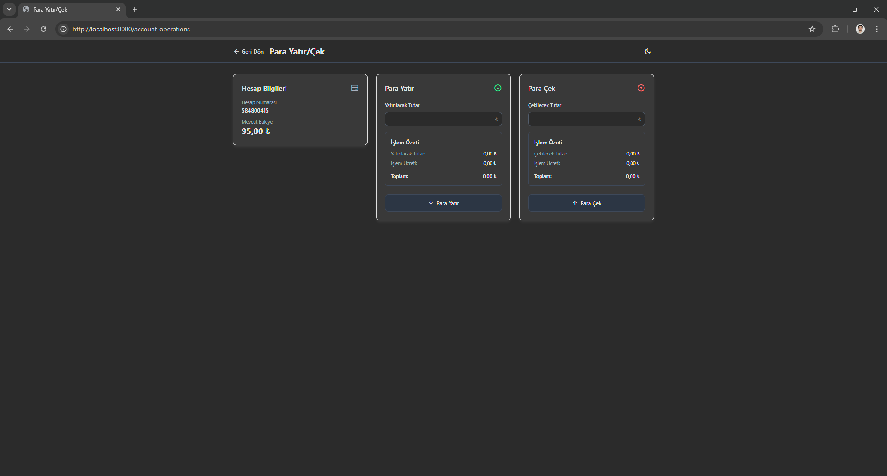 |

### Para Transferi (Money Transfer)

| Light                                                                                 | Dark                                                                                |
| ------------------------------------------------------------------------------------- | ----------------------------------------------------------------------------------- |
| 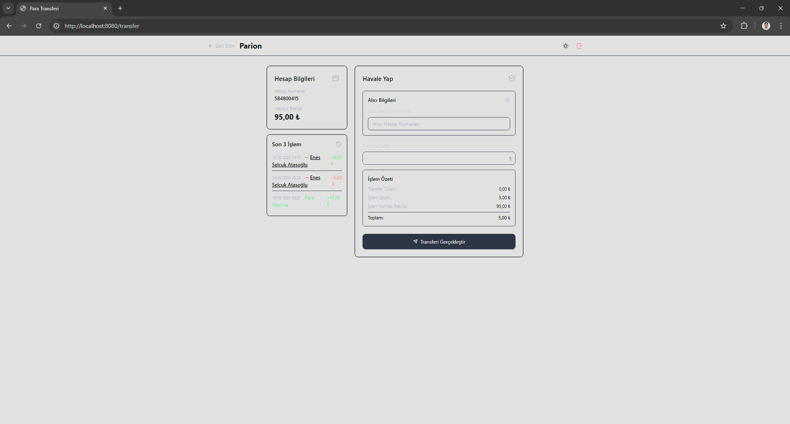 | 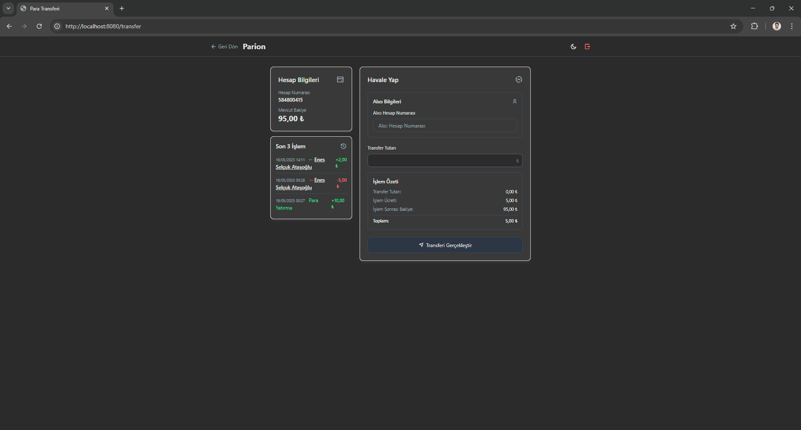 |

### Hesap Hareketleri (Transactions)

| Light                                                                              | Dark                                                                             |
| ---------------------------------------------------------------------------------- | -------------------------------------------------------------------------------- |
| 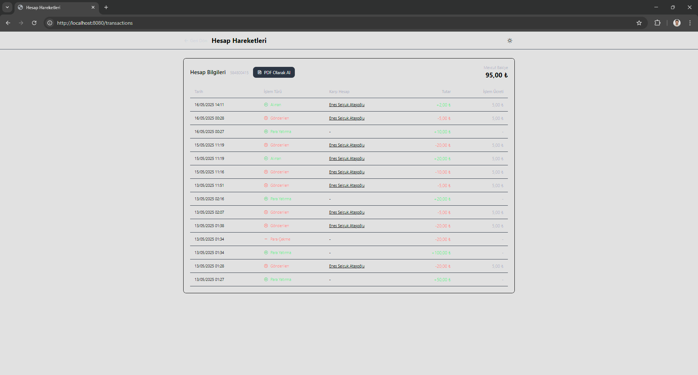 | 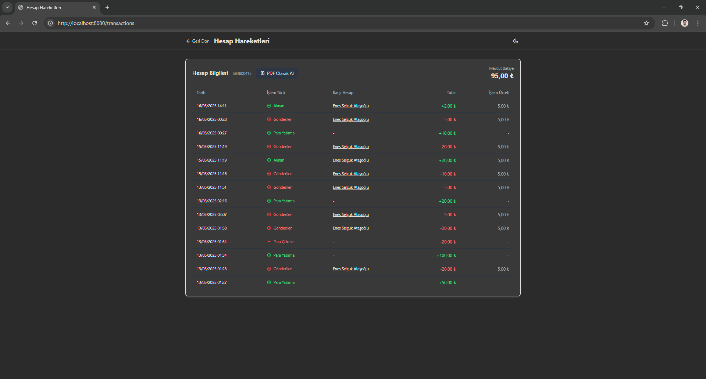 |

### Döviz Detayları (Exchange Details)

| Light                                                                                     | Dark                                                                                    |
| ----------------------------------------------------------------------------------------- | --------------------------------------------------------------------------------------- |
| 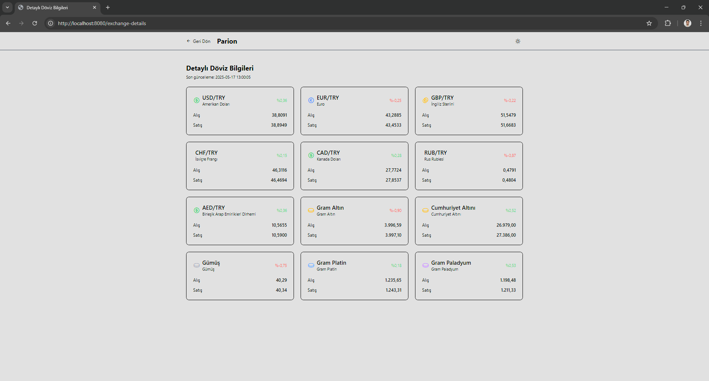 | 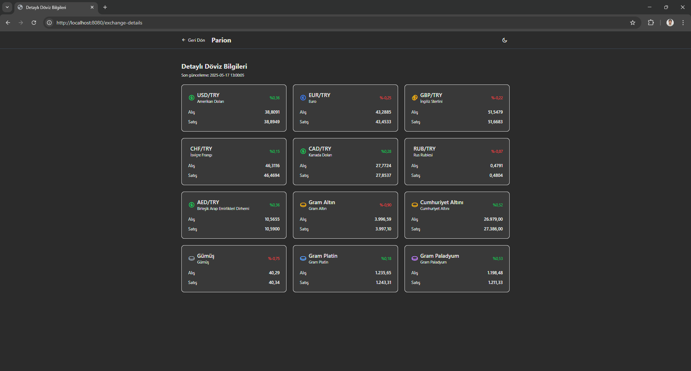 |

## 🔒 Güvenlik

- BCrypt ile şifre şifreleme
- Spring Security ile güvenli kimlik doğrulama
- CSRF koruması
- Session yönetimi

## 📊 Veritabanı Şeması

## 📝 API Dokümantasyonu

### Kullanıcı İşlemleri

- `POST /register` - Yeni kullanıcı kaydı
  - E-posta doğrulama kodu gönderimi
  - TC Kimlik doğrulama
- `POST /login` - Kullanıcı girişi
- `GET /dashboard` - Kullanıcı paneli
- `POST /verify-email` - E-posta doğrulama

### Hesap İşlemleri

- `GET /account-operations` - Hesap işlemleri sayfası
- `POST /deposit` - Para yatırma
- `POST /withdraw` - Para çekme
- `GET /account-statement` - Hesap hareketi raporu
  - PDF formatında indirme
  - E-posta ile gönderim
- `GET /monthly-statement` - Aylık hesap özeti
  - Otomatik e-posta gönderimi
  - PDF formatında indirme

### Transfer İşlemleri

- `GET /transfer` - Transfer sayfası
- `POST /transfer` - Para transferi
  - İşlem onayı için SMS doğrulama
  - E-posta bildirimi
- `GET /api/saved-recipients` - Kayıtlı alıcıları listele
- `POST /api/saved-recipients` - Yeni alıcı kaydet
- `DELETE /api/saved-recipients/{id}` - Alıcı sil
- `GET /api/account/{accountNumber}/user` - Hesap numarasına göre kullanıcı bilgisi

### Döviz ve Altın İşlemleri

- `GET /exchange-details` - Döviz ve altın detayları
- `GET /api/exchange-rates` - Güncel döviz kurları
- `GET /api/gold-prices` - Güncel altın fiyatları

### Güvenlik İşlemleri

- `POST /change-password` - Şifre değiştirme
- `POST /forgot-password` - Şifremi unuttum
- `POST /reset-password` - Şifre sıfırlama

## 📄 Lisans

Bu proje açık kaynaklıdır ve eğitim amaçlı kullanılabilir.

## 👥 İletişim

Proje Sahibi - (https://github.com/selcukatasoglu)

Proje Linki: (https://github.com/selcukatasoglu/digital-banking-system)

Linkedln : https://www.linkedin.com/in/selcukatasoglu/

Gmail : selcukatasogluu@gmail.com
